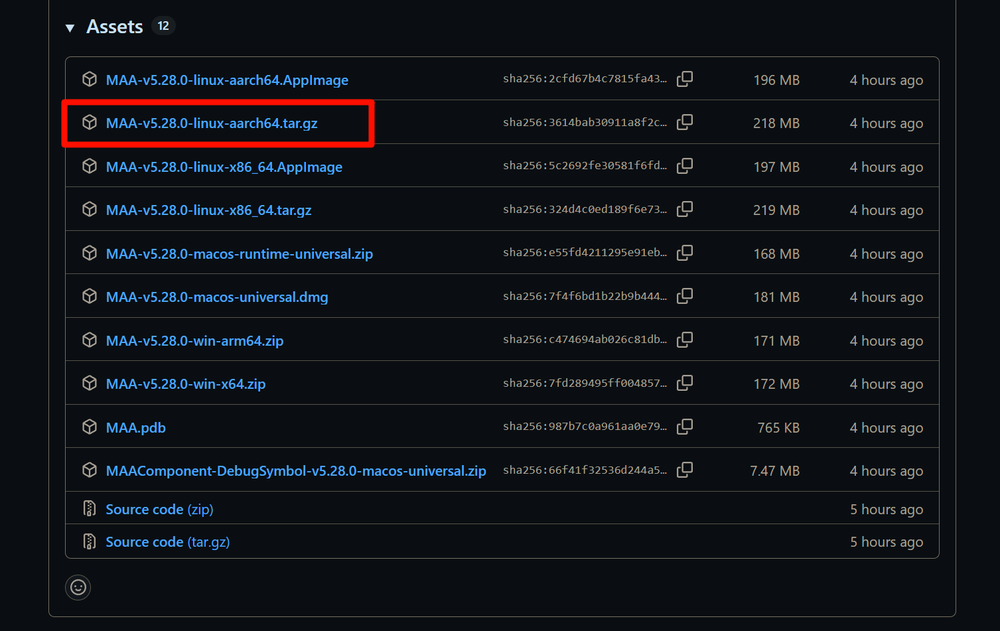
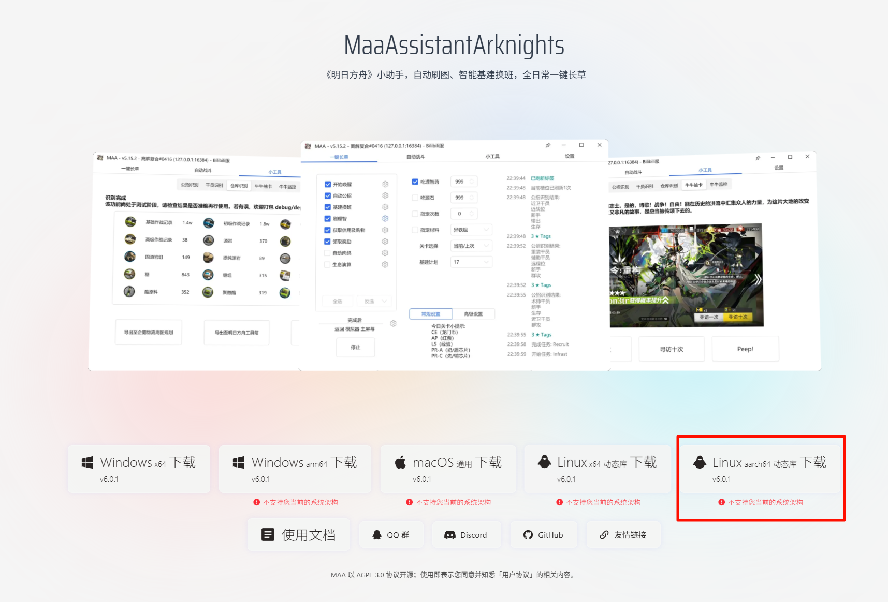
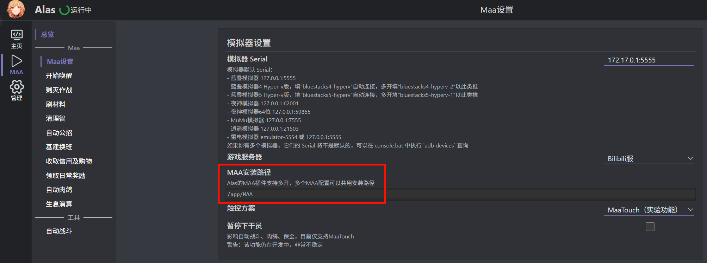

# azurlaneautoscript-arm64

- 同时兼容 [AzurLaneAutoScript](https://github.com/LmeSzinc/AzurLaneAutoScript) 和 [MaaAssistantArknights](https://github.com/MaaAssistantArknights/MaaAssistantArknights) 的 ARM64（aarch64）架构 Docker 镜像。

- 当识别到 ALAS 尚未下载时，自动下载。

- 支持自动识别网络环境，大陆IP自动使用ALAS官方镜像地址 `git://git.lyoko.io/AzurLaneAutoScript`，境外使用 Github 地址 `https://github.com/LmeSzinc/AzurLaneAutoScript.git`

- 支持自定义ALAS项目地址，你可以自行配置（如配置gitee地址在大陆能有较好的速度）。

## 简介：

由于新版  MaaAssistantArknights 要求 glibc 版本在 2.38/2.39 ，现有的基于 Debian12 制作 AzurLaneAutoScript 镜像不满足该要求，将会有如下报错：


因此本镜像改用了 Ubuntu 24.04 作为基础镜像，并在此基础上准备好 AzurLaneAutoScript 环境。

MAA可用性测试如下：


## 适配环境

适用于ARM Linux环境（如ARM NAS等），在绿联DH4300Plus（RK3588）上测试通过，实现在 ARM Linux 上挂机 MAA。

## 快速启动

假设 `/data/azurlaneautoscript-arm64` 为宿主机用于存放 ALAS 和 MAA 的目录。

### 一条命令启动

```bash
sudo docker run -d --restart=unless-stopped -p 22267:22267 --name alas -v /data/azurlaneautoscript-arm64:/app miyouzi/azurlaneautoscript-arm64:latest
```

### Compose 启动

```yaml
services:
  alas:
    image: miyouzi/azurlaneautoscript-arm64:latest
    container_name: alas
    restart: unless-stopped
    ports:
      - "22267:22267"
    volumes:
      - /data/azurlaneautoscript-arm64:/app
```

## 参数配置

容器支持以下环境变量配置： 

| 环境变量名      | 释义                                   | 示例                                           |
| --------------- | -------------------------------------- | ---------------------------------------------- |
| USE_GITHUB_REPO | 强制使用 ALAS 的 Github 地址           | Y                                              |
| ALAS_REPO       | 自定义 ALAS 代码仓库地址（优先级最高） | https://gitee.com/TYCYG/AzurLaneAutoScript.git |

使用环境变量启动示例：

**命令启动：**

```bash
sudo docker run -e ALAS_REPO=https://gitee.com/TYCYG/AzurLaneAutoScript.git -d --restart=unless-stopped -p 22267:22267 --name alas -v /data/azurlaneautoscript-arm64:/app miyouzi/azurlaneautoscript-arm64:latest
```

**Compose 启动：**

```yaml
services:
  alas:
    image: miyouzi/azurlaneautoscript-arm64:latest
    container_name: alas
    restart: unless-stopped
    environment:
      - ALAS_REPO=https://gitee.com/TYCYG/AzurLaneAutoScript.git
    ports:
      - "22267:22267"
    volumes:
      - /data/azurlaneautoscript-arm64:/app
```

## 目录说明

- ALAS 和 MAA 统一放在 `/app` 目录下，建议映射 `/app` 目录以便于修改 ALAS 配置及更新 MAA 。

- `/app/AzurLaneAutoScript` 为 ALAS 存放目录，当文件不存在时会自动 git clone 。

- MAA 需手动下载 arm64 架构的 release （标注为 linux-aarch64）。

  - MAA Github 下载地址：https://github.com/MaaAssistantArknights/MaaAssistantArknights/releases
  - MAA官网下载地址：https://maa.plus/

  

  

- MAA存放至容器映射目录后，在 ALAS 界面配置好 MAA 路径即可使用（路径根据你为 MAA 文件夹的命名而定）：